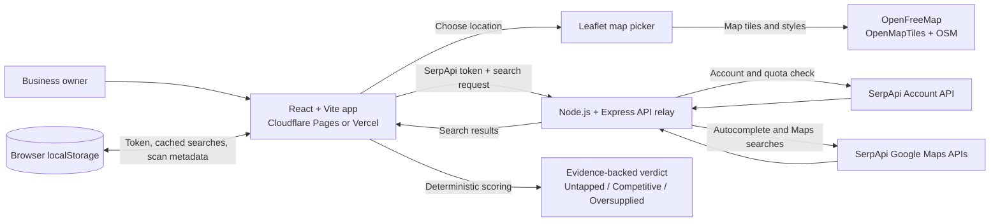

# SiteFit

**Find where your business fits.** SiteFit helps people compare locations before opening a small local business. Choose a category and a pin; SiteFit compares nearby Google Maps businesses and returns an evidence-backed **Untapped / Competitive / Oversupplied** assessment.

> SiteFit is a directional screening tool, not a revenue forecast, pedestrian counter, or guarantee of success. Review totals are lifetime platform activity, not customer counts.

## Hackathon submission overview

- **Project:** SiteFit
- **One-line pitch:** Check a proposed shop location against live local business signals before signing a lease.
- **Problem:** Independent business owners often lack affordable, understandable site-selection research. Enterprise location-intelligence products are generally designed for larger operators, while a manual map search makes it difficult to compare local supply and demand consistently.
- **Approach:** Use SerpApi Google Maps results to compare competitors near a candidate site with a wider local sample. Show business-specific demand-anchor searches, distances, review counts, result coverage, and a transparent directional verdict. Do not infer a headcount from public place data.
- **SerpApi’s role:** Retrieve structured Google Maps local results and account/quota information used to guard uncached searches.
- **Hackathon information:** [SerpApi India Hackathon 2026](https://serpapi.github.io/serpapi-india-hackathon-2026/submit.html?utm_source=india_hackathon_26)
- **Repository:** [kailash16dev/SiteFit](https://github.com/kailash16dev/SiteFit)

## What it does

1. Select a supported business category and search for a locality or place a precise pin. Address suggestions come from SerpApi Google Maps Autocomplete and include selectable coordinates.
2. Query nearby matching businesses and a wider comparison area through SerpApi’s Google Maps engine.
3. For categories configured with demand anchors, also query relevant nearby place types (for example, schools for tuition centres).
4. Combine competitor review activity, relevant demand anchors, and nearby retail context using deterministic rules.
5. Display the places, distances, reasons, confidence, and data caveats behind the verdict.

Current categories include tuition/coaching, preschool/daycare, stationery/bookshop, gym, salon, grocery, pharmacy, clinic, cafe, restaurant, bakery, and mobile/electronics repair.

## Positive impact

SiteFit brings local competitor activity, business-relevant demand anchors, and nearby retail context into one clear pre-lease assessment. It helps independent owners compare candidate areas sooner, spot crowded markets, and identify locations where public signals may indicate room to serve local needs—without requiring enterprise location-intelligence tools or hours of manual map research.

Every assessment shows the places and signals behind its **Untapped / Competitive / Oversupplied** result. This transparency helps owners understand the trade-offs, ask better questions, and make more informed location decisions before committing to a lease. SiteFit is designed to reduce guesswork; it does not promise business success.

## Technology

- **Frontend:** React 19, Vite, Leaflet with MapLibre GL, Lucide icons
- **API relay:** Node.js, Express, Zod, Helmet, CORS
- **Business data and account limits:** SerpApi Google Maps and Account API
- **Address suggestions:** SerpApi Google Maps Autocomplete API (`engine=google_maps_autocomplete`)
- **Map tiles:** OpenFreeMap styles with OpenStreetMap data
- **Persistence:** Browser localStorage for the user-entered key, search cache, and local scan metadata; no user account or application database
- **AI:** No LLM is used. Verdicts are computed by deterministic, inspectable rules.

The small Node.js relay keeps the SerpApi call out of the browser’s cross-origin path, validates requests, and checks the account’s plan and hourly search allowance before sending uncached Maps searches. It does not save the client token or search requests. Cached responses are stored on the browser and can avoid repeat API searches.

## Requirements

- Node.js 20 or newer
- npm
- A SerpApi account and API key for live searches
- Network access to the local API, SerpApi, and OpenStreetMap tile servers

## Run locally

```bash
git clone https://github.com/kailash16dev/SiteFit.git
cd SiteFit
npm install
```

Start the app and enter your SerpApi key in **Settings**. It is stored in that browser’s localStorage and sent to the API relay per request; the relay does not retain it. The frontend and API use local development defaults for their ports and allowed origin.

Start both apps from the repository root:

```bash
npm run dev
```

Open <http://localhost:5173>. The API listens on <http://localhost:8787>; Vite proxies `/api` requests to it. Every SerpApi request requires the browser token.

To build and check the project:

```bash
npm run build
```

## SerpApi request and quota behavior

- Address suggestions call SerpApi `engine=google_maps_autocomplete`; selecting a place uses its returned latitude and longitude. A broad India map center biases initial suggestions; place-specific pin context can be added in a later iteration.
- Feasibility searches call `engine=google_maps` through the API relay; the key is not embedded in frontend code.
- Before each uncached autocomplete or Maps search, the relay checks SerpApi’s Account API for `plan_searches_left` and hourly capacity. Each uncached autocomplete query uses one search from the same allowance. Repeated identical address queries can use a 24-hour cache in that browser. If the required fields are missing or the allowance is insufficient, the Maps batch is not sent.
- The gate uses plan searches remaining, not `total_searches_left`, which may include separate credits. The Account API check itself does not consume a Maps search.
- Requests from SiteFit using the same key are serialized in-process to avoid simultaneous scans passing the same quota check. SerpApi remains authoritative if the key is also used elsewhere.
- Local browser cache hits do not call the Maps search endpoint. Search inputs and results are not stored by the API relay.

## Privacy and key handling

- Never commit a real SerpApi key or place it in frontend source.
- The SerpApi key is entered in Settings, stored in browser localStorage, and sent in the request header only when the user requests a search.
- The API relay does not save keys or search requests.
- SiteFit has no accounts, server-side search history, or database.
- Clearing the browser cache removes locally cached search results. Clearing the token in Settings removes the browser-stored key.

## Architecture



The browser owns the token and cached search results. The API relay validates requests and forwards searches to SerpApi without retaining the token or search history. OpenFreeMap supplies map rendering separately from the analysis data path.

## Scripts

| Command | Purpose |
| --- | --- |
| `npm run dev` | Start the API and Vite frontend together |
| `npm run build` | Build the frontend and syntax-check the API |
| `npm run start` | Start the API relay |

## License

No license has been selected yet. All rights are reserved unless and until a license is added.
